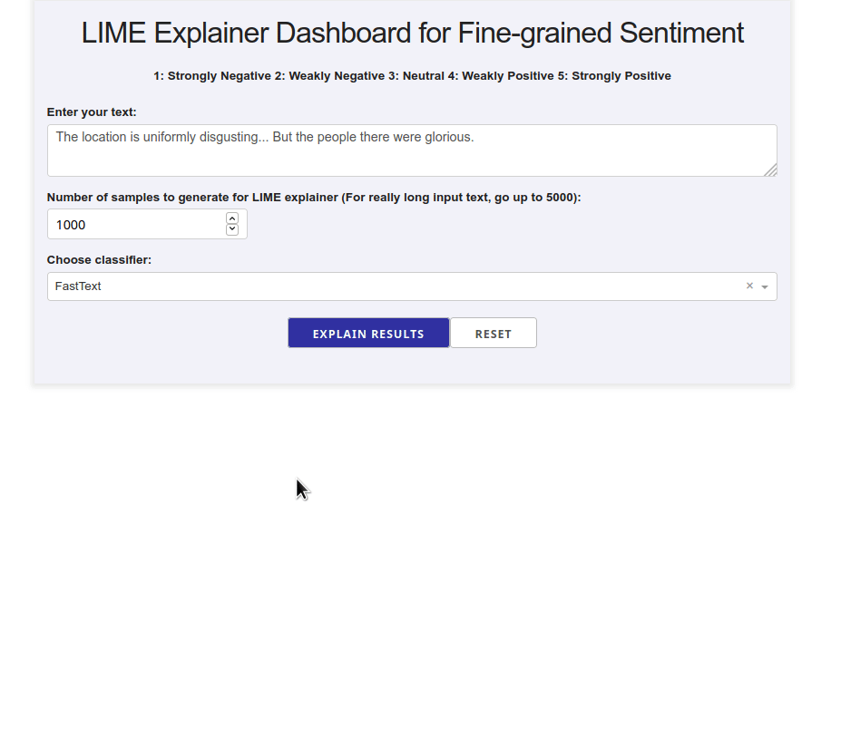

# A Dash Explainer App for Fine Grained Sentiment Classification

This repo contains the Plotly Dash equivalent of an existing interactive application, that explains the results of fine-grained sentiment classification, described in detail in [this Medium Series](https://medium.com/@tech_optimist/fine-grained-sentiment-analysis-in-python-part-2-2a92fdc0160d).

A number of classifiers are implemented and their results explained using the [LIME explainer](https://arxiv.org/pdf/1602.04938.pdf). 
The classifers were trained on the  [Stanford Sentiment Treebank](https://nlp.stanford.edu/sentiment/) (SST-5) dataset. The class labels are any of `[1, 2, 3, 4, 5]`, where `1` is very negative and `5` is very positive. 

## Why Dash?
[Dash](https://dash.plotly.com/) is a powerful, highly customizable library for building dashboards in Python. It is written on top of Flask, Plotly.js and React.js, allowing for fluid, reactive web applications that scale well to multiple client sessions. It also allows developers a lot of flexibility to customize the app's appearance, by providing access to the underlying CSS.

## Installation

First, set up virtual environment and install from `requirements.txt`:

    python3 -m venv venv
    source venv/bin/activate
    pip3 install -r requirements.txt

For further development, simply activate the existing virtual environment.

    source venv/bin/activate

## Usage

Run the file `app.py` and then enter a sentence, choose a type of classifier and click on the button `Explain results`. We can then observe the features (i.e. words or tokens) that contributed to the classifier predicting a particular class label.

## Demo for the front-end

The front-end app takes in a text sample and outputs LIME explanations for the different methods. The app is is deployed using Heroku at this location: https://sst5-explainer-dash-0642.herokuapp.com/

Play with your own text examples as shown below and see the fine-grained sentiment results explained!

**NOTE:** Because the PyTorch-based models (Flair and the causal transformer) are quite expensive to run inference with (they require a GPU), these methods are not deployed. However, they can be run on a local instance of the app.

